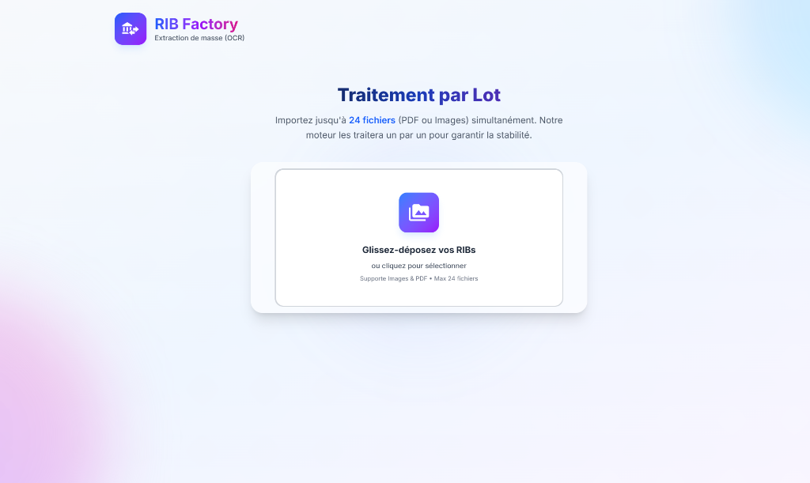
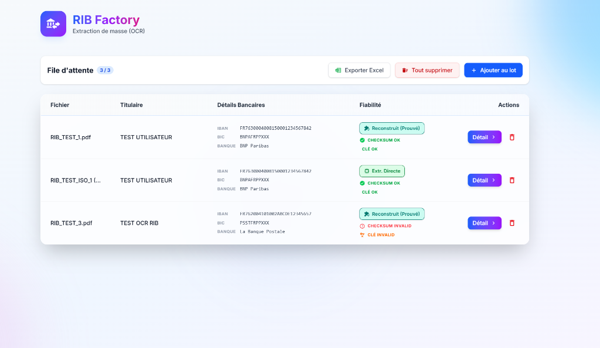
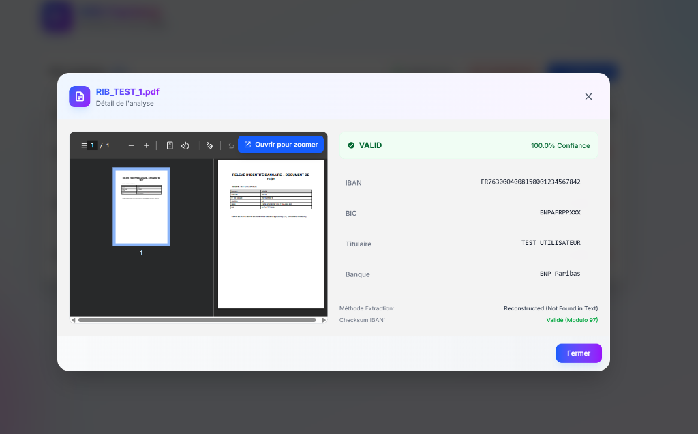

# 🏦 RIB Factory - Analyseur et Validateur de RIB

  

**RIB Factory** est une solution complète et sécurisée pour l'analyse, l'extraction OCR et la validation bancaire stricte (Banque de France / SEPA) de vos Relevés d'Identité Bancaire.

Conçu pour l'automatisation et la fiabilité, il transforme des documents (PDF, Images) en données structurées et vérifiées.

---

## 📸 Aperçu

<div align="center">
  
  <p><em>Zone de dépot moderne et fluide</em></p>
  <br/>
  
  <p><em>Traitement par lot avec status de validation en temps réel</em></p>
  <br/>
  
  <p><em>Inspection détaillée avec zoom et confiance OCR</em></p>
</div>

---

## ✨ Fonctionnalités Clés

### 🔍 Analyse & OCR
- **Extraction Intelligente** : Utilise des modèles de Deep Learning avancés (Doctr) pour lire les RIBs, même flous ou inclinés.
- **Support Multi-Formats** : Accepte PDF, JPG, PNG.
- **Détection Automatique** : Localise précisément l'IBAN, le BIC, le Titulaire et la Banque.

### 🛡️ Confidentialité & Souveraineté (100% Local)
- **Traitement Autonome** : Aucune donnée ne sort de votre serveur. L'OCR (Doctr) et les validations sont exécutées localement sur votre machine.
- **Zéro API Externe** : Pas de dépendance à Google Vision, AWS ou Azure. Vous êtes totalement propriétaire de vos données bancaires.
- **RGPD Ready** : L'architecture conteneurisée garantit que les fichiers traités ne sont stockés que temporairement (ou selon votre politique) sans tiers impliqué.

### 🛡️ Validation Industrielle (Nouveauté)
- **Vérification Mathématique** : Calcul rigoureux des clés de contrôle (Modulo 97).
- **Conformité SEPA** : Validation des IBANs via la librairie `schwifty` (Standard ISO).
- **Clé RIB Française** : Algorithme spécifique pour valider la cohérence Banque/Guichet/Compte/Clé (Algorithme "Check Digits").
- **Détection des Fraudes** : Rejette immédiatement les faux RIBs générés avec des clés invalides.

### 🚀 Interface Premium
- **Batch Processing** : Téléversez et traitez plusieurs fichiers en simultané.
- **Design Moderne** : Interface "Glassmorphism" soignée, animations fluides et mode sombre.
- **Export Excel** : Téléchargez les résultats validés en un clic.

---

## 🛠️ Stack Technologique

Une architecture moderne, conteneurisée et performante.

### Backend (Python)
- **FastAPI** : API haute performance, asynchrone et typée.
- **Doctr (Deep Learning)** : Moteur OCR de pointe pour la reconnaissance de documents.
- **Schwifty & Python-Stdnum** : Bibliothèques de référence pour la validation financière (IBAN/BIC/RIB).
- **OpenCV & Numpy** : Prétraitement d'image avancé.

### Frontend (TypeScript)
- **Next.js 14/15** : Framework React pour une application réactive et optimisée (Standalone Build).
- **Tailwind CSS v4** : Styling utilitaire nouvelle génération.
- **Framer Motion** : Animations fluides de l'interface.

### Infrastructure
- **Docker & Docker Compose** : Déploiement "One-Click" (Front + Back isolés).
- **Production Ready** : Images optimisées (Debian Bookworm pour le back, Alpine pour le front).

---

## 🚀 Installation & Déploiement

Le projet est conçu pour être déployé en 3 commandes sur n'importe quel serveur Linux (Debian/Ubuntu recommandé).

### Pré-requis
- Docker & Docker Compose
- Git

### Installation Rapide

```bash
# 1. Cloner le projet
git clone https://github.com/votre-user/rib-factory.git
cd rib-factory

# 2. Lancer l'application (Build automatique)
docker-compose up -d --build

# 3. Accéder à l'application
# Frontend : <http://localhost:3000>
# Backend (Docs API) : <http://localhost:8000/docs>
```

---

## 📦 Version EXE Autonome (Windows)

Si vous souhaitez utiliser l'application sans Docker ni installation de serveur, vous pouvez générer un **fichier .exe unique** qui regroupe le frontend, le backend et l'OCR.

### Pré-requis
- **Python 3.10+**
- **Node.js & NPM** (pour compiler l'interface)

### Procédure de Génération
C'est très simple, un seul script automatise tout le processus :

1. Ouvrez un terminal **PowerShell** à la racine du projet.
2. Lancez le script de packaging :
   ```powershell
   ./package_exe.ps1
   ```
3. Le script va :
   - Compiler l'interface Next.js.
   - Préparer les fichiers du backend.
   - Packager le tout dans un seul fichier.

Une fois terminé, vous trouverez votre application prête à l'emploi ici :
`dist/RIB_Factory.exe`

> [!NOTE]
> Le fichier généré est volumineux (environ 800 Mo) car il contient les modèles d'intelligence artificielle nécessaires pour l'OCR autonome.

---

## 📄 Droits et Licence

Ce projet est distribué sous la licence **GNU General Public License v3.0 (GPLv3)**.

### Ce que cela signifie pour vous :
*   ✅ **Liberté d'utilisation** : Vous pouvez utiliser ce logiciel pour tout usage, privé ou commercial.
*   ✅ **Liberté de modification** : Vous avez le droit de modifier le code source.
*   ✅ **Liberté de distribution** : Vous pouvez partager le logiciel (modifié ou non).
*   ⚠️ **Obligation de partage (Copyleft)** : Si vous distribuez ce logiciel (ou une version modifiée), **vous devez le faire sous la même licence GPLv3** et fournir le code source. Il n'est pas permis de fermer le code ("Close Source") d'un dérivé de ce projet.

*Pour plus de détails, consultez le fichier [LICENSE](./LICENSE).*

---

## ❤️ Remerciements

Un grand merci à toutes les briques Open Source qui rendent ce projet possible, notamment les équipes derrière **Doctr** (Mindee), **FastAPI** (Tiangolo), et **Next.js** (Vercel).

*Développé par @jerome0025 pour simplifier la validation bancaire.*
